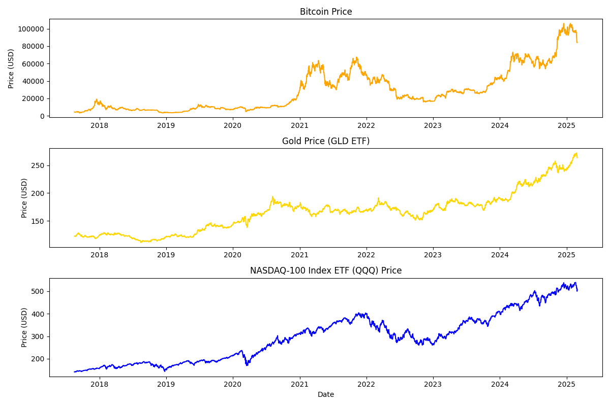
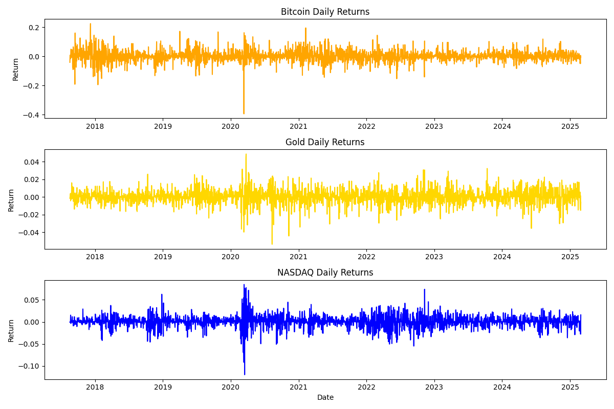
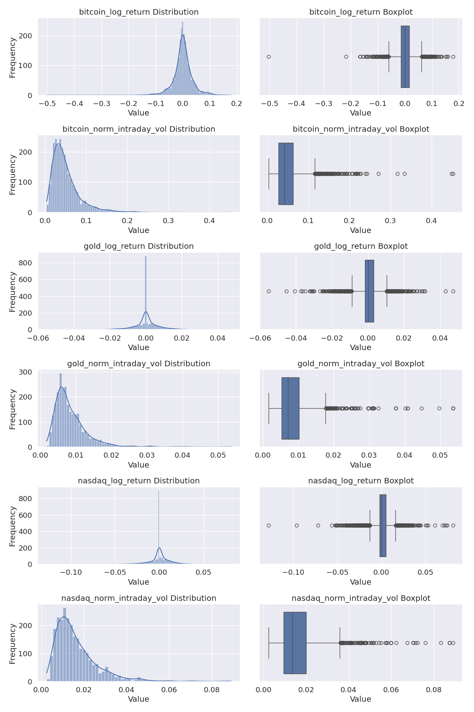

# Asset Background and Macroeconomic Significance

As the central role we study in this article, Bitcoin, emerging in 2009 as the first cryptocurrency, represents digital financial innovation and operates without central authority oversight. It exhibits heightened volatility compared to traditional assets while demonstrating sensitivity to monetary policy decisions and market liquidity conditions, increasingly gaining acceptance among institutional investors seeking portfolio diversification despite its evolving correlation patterns during market stress periods.

Study above Bitcoin behaviros and relations to economy directly can be very hard due to modern ecomcomy complxity and dirversity, so try our best to get a bit clue we thinkg it would be benifical to compare bitcoin to tradional assets,  we find Bitcoin two companies in this article:

Gold stands as one of humanity's oldest stores of value, functioning in modern markets as a traditional safe-haven asset and inflation hedge. The GLD ETF provides liquid exposure to gold, which typically maintains negative correlation with U.S. dollar strength, appreciates during inflationary periods, and responds to geopolitical tensions and systemic financial risks—its relative attractiveness fluctuating inversely with real interest rates.

The NASDAQ-100 Index, tracked by the QQQ ETF, represents technology and innovation sectors driving economic growth in developed economies. Comprising primarily non-financial companies, the index demonstrates sensitivity to interest rates due to its growth-oriented constituents, with performance reflecting technological advancement and productivity gains—making it an effective proxy for innovation-driven economic expansion.

We believed by examining above three distinct asset classes—Bitcoin, Gold, we can gain more deep understanding of relations of modern cropto assests and tradional assetes and their interacion and response to macro enviroment.

## Data Collection Overview

This analysis utilizes daily OHLC (Open, High, Low, Close) price data from 2018/01/01 till 2025/02/28 for three key assets:

1. **Bitcoin (BTC)**
   - Source: Binance Data Vision

2. **Gold (GLD ETF)**
   - Source: Alpha Vantage API
   - ETF Details:
     - Tracks the price of physical gold
     - Listed on NYSE Arca (ticker: GLD)

3. **NASDAQ-100 Index (QQQ ETF)**
   - Source: Alpha Vantage API
   - ETF Details:
     - Tracks the NASDAQ-100 index
     - Listed on NASDAQ (ticker: QQQ)

# Daily Price Behavior of Bitcoin and Traditional Asset
The log return is calculated using the natural logarithm of the ratio between consecutive closing prices. The formula is:

$$ r_t = \ln\left(\frac{P_t}{P_{t-1}}\right) $$

Where:
- $ r_t $ is the log return at time t
- $ P_t $ is the closing price at time t
- $ P_{t-1} $ is the closing price at the previous time period (t-1)
- $ \ln $ is the natural logarithm function

Here our period is one day.
We also estimated intraday normalized volatility for each asset, calculated as the daily high-low range divided by the opening price. The formula is:

$$ v_t = \frac{H_t - L_t}{O_t} $$

Where:
- $ v_t $ is the normalized intraday volatility at time t
- $ H_t $ is the daily high price
- $ L_t $ is the daily low price
- $ O_t $ is the daily opening price

 Interested readers can visit the source code at https://github.com/hepzanechen/bitcoinMacroeconomy for more calculation details. This calculation provides a continuous compounding return measure that is symmetric and additive over time, making it particularly useful for financial analysis and modeling.

## Price and Return Visualizations

For interactive visualizations, please see [all_plots_interactive.html](./plots/all_plots_interactive.html)

## Asset Return and Volatility Distributions

### Statistical Summary
|          |   bitcoin_log_return |   bitcoin_norm_intraday_vol |   gold_log_return |   gold_norm_intraday_vol |   nasdaq_log_return |   nasdaq_norm_intraday_vol |
|:---------|---------------------:|----------------------------:|------------------:|-------------------------:|--------------------:|---------------------------:|
| count    |            2616.0000 |                   2616.0000 |         2616.0000 |                2616.0000 |           2616.0000 |                  2616.0000 |
| mean     |               0.0007 |                      0.0505 |            0.0003 |                   0.0085 |              0.0005 |                     0.0163 |
| std      |               0.0361 |                      0.0369 |            0.0075 |                   0.0050 |              0.0126 |                     0.0101 |
| min      |              -0.5026 |                      0.0034 |           -0.0552 |                   0.0017 |             -0.1276 |                     0.0025 |
| 1%       |              -0.1045 |                      0.0089 |           -0.0213 |                   0.0026 |             -0.0388 |                     0.0045 |
| 5%       |              -0.0574 |                      0.0142 |           -0.0121 |                   0.0035 |             -0.0209 |                     0.0058 |
| 25%      |              -0.0143 |                      0.0271 |           -0.0018 |                   0.0054 |             -0.0021 |                     0.0095 |
| 50%      |               0.0006 |                      0.0411 |            0.0000 |                   0.0071 |              0.0000 |                     0.0136 |
| 75%      |               0.0161 |                      0.0624 |            0.0031 |                   0.0103 |              0.0052 |                     0.0201 |
| 95%      |               0.0549 |                      0.1208 |            0.0128 |                   0.0169 |              0.0195 |                     0.0348 |
| 99%      |               0.0988 |                      0.1864 |            0.0210 |                   0.0269 |              0.0332 |                     0.0508 |
| max      |               0.1784 |                      0.4527 |            0.0474 |                   0.0537 |              0.0813 |                     0.0891 |
| skewness |              -1.1615 |                      2.8224 |           -0.3224 |                   2.9579 |             -0.5966 |                     2.1172 |
| kurtosis |              17.2005 |                     16.0629 |            5.5146 |                  16.0317 |              9.9513 |                     7.6063 |

*<a id="figure1">Figure 1</a>: Asset log return distributions and boxplots alongside normalized intraday volatility distributions and boxplots for Bitcoin, Gold, and Nasdaq*

As shown in [Figure 1](#figure1), Bitcoin demonstrates the highest volatility among the three assets, with significant negative skewness and fat tails. This suggests a greater likelihood of extreme price movements compared to Gold and Nasdaq. Bitcoin's volatility patterns align with the unique characteristics of cryptocurrency markets, including 24/7 trading, lower liquidity, and heightened sensitivity to news events.

In contrast, Gold maintains the lowest overall volatility, consistent with its status as a stable "safe haven" asset. However, it still experiences occasional sharp volatility spikes as can be seen by Boxplot. Those spikes are at periods of market stress, such as major geopolitical or macroeconomic events. 

Nasdaq exhibits intermediate characteristics, with moderate volatility and negative skewness. All three assets display non-normal return distributions with heavy tails, indicating that traditional models based on normal distribution assumptions may significantly underestimate risk, particularly for Bitcoin. Investors should carefully account for these fat-tailed distributions when developing portfolio diversification strategies, managing risk, and implementing hedging approaches. Ignoring the potential for tail events could result in a substantial underestimation of downside risk exposure.

### Black Swan, Extreme Market Conditons Exploration
As showed in 